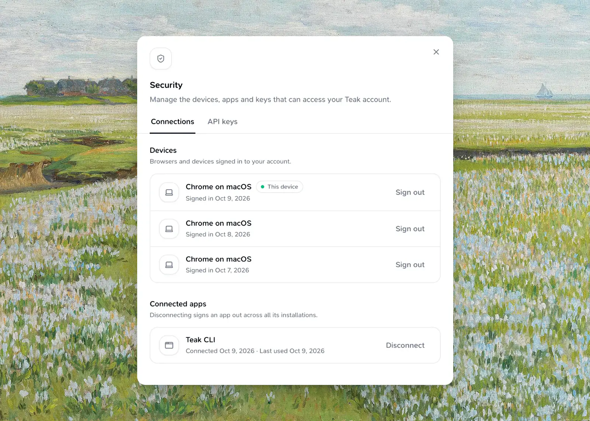

The Teak CLI lets you save, search, tag, favorite, update, delete, restore, and export cards without leaving your terminal.

## Install

```package-install
npm i -g teak-cli
```

After installing globally, the `teak` command is available on your PATH. To try it without installing: `npx teak-cli@latest --help`.

## Authentication

<Tabs param="auth">
  <Tab title="Browser sign-in">
    Run:

    ```bash
    teak login
    ```

    Teak opens your browser to authorize the CLI. Approve the request on the
    consent screen, then return to the terminal. You stay signed in until you
    run `teak logout` or disconnect the app in Settings.

    `teak login --no-browser` prints the sign-in URL instead of opening it.
    Open it in a browser on the same computer, because sign-in finishes on a
    local callback.
  </Tab>
  <Tab title="API key">
    Set `TEAK_API_KEY` to skip interactive sign-in in scripts and CI:

    ```bash
    TEAK_API_KEY=teakapi_... teak ls --json
    ```

    Generate and manage API keys in Teak Settings — see the [API guide](/docs/api) for key limits and rotation.
  </Tab>
</Tabs>

Check which account and credential the CLI is using with `teak auth status`. `teak whoami` shows your email, plan, and how many cards you've used.

```bash
teak logout
```

`teak logout` revokes browser sign-in and disconnects every CLI installation; reconnecting can take about five minutes. If the saved sign-in has already expired, logout clears only this device and says so — disconnect other installations in **Settings → Security → Connected apps**. If the network fails, credentials stay saved; run `teak logout` again before signing in so Teak can revoke the previous session. API keys are unaffected.



Credentials are stored separately for each API deployment, so local development cannot use or clear your production sign-in.

## SDK token providers

The `teak-sdk` package's `TokenProvider.onUnauthorized(rejectedToken: string)` receives the access token
used by the request that returned 401. Return a refreshed or newer stored token
to retry that request once, or `null` to stop. Compare the rejected token with
the current session before refreshing; a late response may refer to an older token.

The client covers every [API](/docs/api) endpoint: `cards.list`, `search`, `favorites` (with `trashed`, `style`, `hue`, and `hex` filters), `get`, `create`, `update` (including `removeAiTags`), `setFavorite`, `delete` (pass `{ permanent: true }` to skip Trash), `restore`, `duplicate`, `bulk`, and `changes`, plus `tags.list`, `uploads`, `me`, and `exports.start` / `exports.latest`. Pass `{ idempotencyKey }` to `cards.create` or `cards.bulk` to make retries safe. Errors are `TeakApiError`s with a `code`, `status`, `retryAt`, and the response's `requestId`.

The SDK also includes the WorkOS Connect sign-in steps that the CLI, Raycast, and
browser extension use: `randomBase64Url` and `createPkceChallenge` for PKCE,
`createConnectAuthorizeUrl`, `requestConnectTokens` for code and refresh grants,
`fetchConnectOwnerId`, and `disconnectConnectGrant`. Use the client ID that
`discoverAuthServer` returns for your surface. `requestConnectTokens` returns
`refresh_token_rejected` only when WorkOS says the refresh token is no longer valid;
treat other failures as temporary and keep the saved sign-in.

## Commands

```bash
teak add "A note from the terminal" --tags research
teak add --url https://example.com --tags research,web
teak add --file ./screenshot.png --notes "Inspiration" --tags inspiration
teak add --file ./component.tsx --tags source
teak ls
teak search "blue buttons"
teak cards get <card-id>
teak open <card-id>
teak download <card-id> -o ./poster.png
teak cards update <card-id> --title "Homepage ideas" --tags design,reference
teak tags add <card-id> inspiration
teak tags rm <card-id> inspiration
teak fav <card-id>
teak rm <card-id>
teak trash
teak restore <card-id>
teak tags
```

`teak add` also accepts a bare URL or file path as the positional argument (for
example `teak add https://example.com`) — the CLI detects whether it's text,
a URL, or a file. Use `--url` / `--file` when you want to be explicit or when
scripting.

File uploads support the same formats as the web app (source files, Markdown and MDX, ZIP archives, documents, images, audio, and video — see [Features](/docs/features)), up to 100 MB. `.md` and `.markdown` files become editable text cards, must be valid UTF-8, and are limited to 512 KiB; `.mdx` remains a document.

Like the web composer, Teak works out the card type from what you add: a URL becomes a link, text in quotation marks becomes a quote, and a list of colors becomes a palette. Pass `--type text` (or `quote`, `palette`, …) to choose. Structured Markdown always stays a text card and is stored exactly as submitted, including from standard input. Text cards have a 512 KiB UTF-8 limit.

`teak cards get` shows the card's title, notes, tags, Teak's AI tags and summary, colors, file, transcript, and a link to open it on the web. `teak open` opens that link in your browser, and `teak download` saves a file card's original file (`--force` replaces an existing file).

`teak tags add` and `teak tags rm` change one card's tags without retyping the rest. `teak tags rm` also removes tags Teak added. `teak cards update --tags` replaces the card's own tags, and `--content -` reads the new content from standard input.

### Trash

`teak rm` moves cards to Trash, and `teak restore` brings them back. `teak trash` lists what's there; Teak empties it after 30 days. `teak rm --permanent` deletes for good: it asks first in a terminal, and needs `--yes` in scripts.

### Filter and page through cards

`teak ls`, `teak search`, `teak trash`, and `teak cards favorites` accept the same filters as search on the web:

| Option | Filter |
| --- | --- |
| `--type <type>` | Card type. Repeat to match any of several. |
| `--tag <tag>` | Exact tag |
| `--favorited` / `--trashed` | Favorites only / Trash only |
| `--style <style>` | Visual style, such as `minimal` or `vintage`. Repeatable. |
| `--hue <hue>` | Color family, such as `blue` or `neutral`. Repeatable. |
| `--hex <color>` | Exact color, such as `#112233`. Repeatable. |
| `--date <phrase>` | When it was saved: `today`, `last week`, `march 2026`, `2026-01-01 to 2026-02-01` |
| `--created-after` / `--created-before` | Millisecond timestamps |
| `--sort newest\|oldest`, `--limit`, `--cursor` | Order and paging |
| `--include content,metadata,processing` | Extra fields (`content` by default) |
| `--all` | Fetch every page |

```bash
teak ls --type image --type link --hue blue --date "last month"
teak search "homepage" --tag design --all --json > cards.json
```

### Export

```bash
teak export -o teak-backup.zip
```

`teak export` starts a ZIP export of every card and original file, the same as the web's export. Add `--wait` to wait for it, or `-o` to wait and save the ZIP. `teak export status` shows progress, and `teak export download` saves the latest ready export. You can start one export every 7 days.

### Sync and bulk edits

```bash
teak cards changes --since 1767225600000 --json
teak cards bulk update --input updates.json
```

`teak cards changes` returns cards changed since a millisecond timestamp, plus the IDs of deleted cards with `--json`. `teak cards bulk` runs `create`, `update`, `favorite`, or `delete` on a JSON array of up to 100 items, read from `--input` or standard input. Items use the same shape as the [API's bulk endpoint](/docs/api#reliable-requests).

### Global options

| Option | Purpose |
| --- | --- |
| `--json` | Machine-readable output |
| `--api-key <key>` | Use an API key for this command (same as `TEAK_API_KEY`) |
| `--api-url <url>` | Point at another API, such as a self-hosted or development deployment (same as `TEAK_API_URL`) |

### Getting help

Run any command with `--help` to see available options:

```bash
teak --help
teak add --help
teak search --help
```

## Output Format

By default, commands print human-readable output. Add `--json` to any command for machine-readable JSON, useful for piping into `jq` or other tools:

```bash
teak search "buttons" --json | jq '.items[].url'
```

## Troubleshooting

<Accordion>
  <AccordionItem title="teak: command not found">
    - Confirm the package installed globally: `npm ls -g teak-cli`
    - Make sure your npm global bin directory is in your `PATH`.
  </AccordionItem>
  <AccordionItem title="Login opens the browser but never completes">
    - Check your internet connection.
    - Try again in case the local callback port was already in use.
    - As a fallback, use `TEAK_API_KEY` with a key from Settings.
  </AccordionItem>
  <AccordionItem title='Commands return "Unauthorized"'>
    - Run `teak login` to refresh your session.
    - If using `TEAK_API_KEY`, confirm the key is still active in Teak Settings.
  </AccordionItem>
  <AccordionItem title="Still stuck?">
    Reach out via [Support](/docs/support).
  </AccordionItem>
</Accordion>
